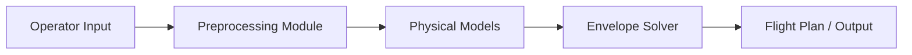
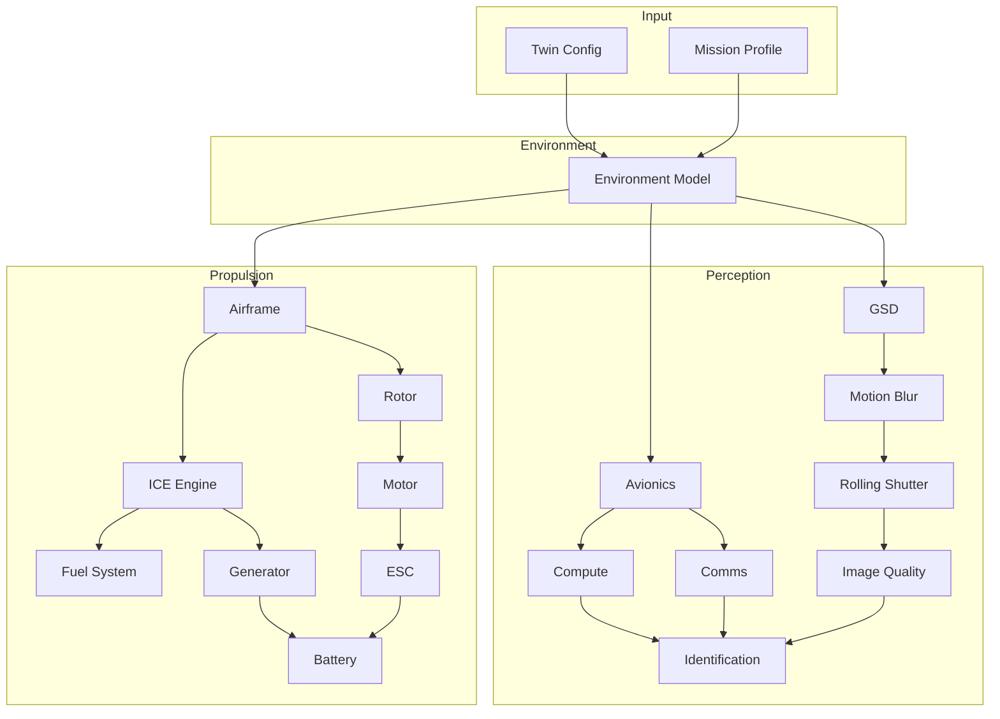
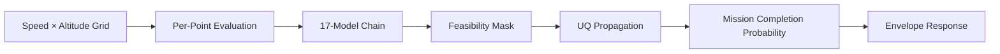

# System Architecture

Data flow and model chain for the Gorzen digital twin platform.

## Data Flow



## Model Chain (17 Models)



## Envelope Solver Pipeline



## API Structure

```mermaid
flowchart TB
    Client[Frontend / Client] --> API[FastAPI]
    API --> TwinRouter[/twin]
    API --> EnvelopeRouter[/envelope]
    API --> MissionRouter[/mission]
    API --> CatalogRouter[/catalog]
    TwinRouter --> Solver[Envelope Solver]
    EnvelopeRouter --> Solver
    MissionRouter --> Solver
```
