# Gorzen 17-Model Chain: Formula Flow Chart

## Overview

The envelope solver evaluates **17 physics models in sequence** at every (speed, altitude) grid point. Each model's outputs feed forward as inputs to downstream models. The final output is **P(identification success)** — the probability that the drone can successfully identify a target at that operating point.

```
 ENVIRONMENT          PROPULSION & ENERGY          PERCEPTION & ID
 ============         ===================          ================

 [1] Environment                                   [13] GSD
       |                                                  |
       v                                                  v
 [2] Airframe -----> [3] ICE Engine              [14] Motion Blur
       |                   |                              |
       |                   v                              v
       |             [4] Fuel System             [15] Rolling Shutter
       |                                                  |
       v                                                  v
 [5] Rotor -------> [6] Motor Elec              [16] Image Quality (GIQE)
                          |                               |
                          v                               v
                     [7] ESC Losses             [17] Identification Conf.
                          |                          = FINAL OUTPUT =
                          v
                     [8] Battery
                          |
                          v
                     [9] Generator
                          |
                          v
                    [10] Avionics
                          |
                          v
                    [11] Compute
                          |
                          v
                    [12] Comms
```

---

## Mermaid Diagram (renders on GitHub)

```mermaid
flowchart TD
    subgraph ENV["Phase 1: Environment"]
        M1["1. Environment Model<br/><i>ISA density, wind, temperature</i>"]
    end

    subgraph AERO["Phase 2: Aerodynamics"]
        M2["2. Airframe Model<br/><i>Drag, lift, flight mode</i>"]
    end

    subgraph PROP["Phase 3: Propulsion & Energy"]
        M3["3. ICE Engine<br/><i>Fuel flow, available power</i>"]
        M4["4. Fuel System<br/><i>Endurance, fuel remaining</i>"]
        M5["5. Rotor Model<br/><i>VTOL thrust & power</i>"]
        M6["6. Motor Electrical<br/><i>Current, voltage, efficiency</i>"]
        M7["7. ESC Losses<br/><i>Total electrical demand</i>"]
        M8["8. Battery<br/><i>Voltage sag, SoC, endurance</i>"]
        M9["9. Generator<br/><i>Charging, hybrid boost</i>"]
    end

    subgraph AVIONICS["Phase 4: Avionics & Compute"]
        M10["10. Avionics<br/><i>Position uncertainty, geotag error</i>"]
        M11["11. Compute<br/><i>Inference latency, thermal throttle</i>"]
        M12["12. Comms<br/><i>Link margin, bandwidth quality</i>"]
    end

    subgraph PERCEPTION["Phase 5: Perception & Identification"]
        M13["13. GSD<br/><i>Ground sample distance, pixels on target</i>"]
        M14["14. Motion Blur<br/><i>Smear pixels, safe speed</i>"]
        M15["15. Rolling Shutter<br/><i>RS skew & wobble distortion</i>"]
        M16["16. Image Quality<br/><i>GIQE/NIIRS composite score</i>"]
        M17["17. Identification<br/><i>P(identification success)</i>"]
    end

    M1 -->|"air_density, temp, wind"| M2
    M2 -->|"drag, rotor_lift_required, flight_mode"| M3
    M2 -->|"rotor_lift_required_N"| M5
    M3 -->|"fuel_flow_rate_g_hr"| M4
    M3 -->|"throttle_pct, generator_power_w"| M9
    M5 -->|"rotor_rpm, torque, power"| M6
    M6 -->|"motor_current_A, power_elec_W"| M7
    M7 -->|"total_electrical_power_W"| M8
    M8 -->|"soc_pct, battery_feasible"| M9
    M9 -->|"electrical_budget"| M10
    M10 -->|"geotag_error"| M11
    M11 -->|"compute_power_W, latency"| M12
    M12 -->|"compression_quality_factor"| M13
    M13 -->|"gsd_cm_px, pixels_on_target"| M14
    M14 -->|"smear_pixels, safe_speed"| M15
    M15 -->|"rs_total_distortion_px"| M16
    M16 -->|"image_utility_score, niirs"| M17

    style M1 fill:#1e3a5f,stroke:#56a4ff,color:#fff
    style M2 fill:#1e3a5f,stroke:#56a4ff,color:#fff
    style M3 fill:#2d1f4e,stroke:#a78bfa,color:#fff
    style M4 fill:#2d1f4e,stroke:#a78bfa,color:#fff
    style M5 fill:#2d1f4e,stroke:#a78bfa,color:#fff
    style M6 fill:#2d1f4e,stroke:#a78bfa,color:#fff
    style M7 fill:#2d1f4e,stroke:#a78bfa,color:#fff
    style M8 fill:#2d1f4e,stroke:#a78bfa,color:#fff
    style M9 fill:#2d1f4e,stroke:#a78bfa,color:#fff
    style M10 fill:#1a3c34,stroke:#10b981,color:#fff
    style M11 fill:#1a3c34,stroke:#10b981,color:#fff
    style M12 fill:#1a3c34,stroke:#10b981,color:#fff
    style M13 fill:#3b1f1f,stroke:#f59e0b,color:#fff
    style M14 fill:#3b1f1f,stroke:#f59e0b,color:#fff
    style M15 fill:#3b1f1f,stroke:#f59e0b,color:#fff
    style M16 fill:#3b1f1f,stroke:#f59e0b,color:#fff
    style M17 fill:#7f1d1d,stroke:#ef4444,color:#fff
```



---

## Detailed Model Chain with Key Formulas

### 1. Environment Model
**File:** `backend/src/gorzen/models/environment.py`
**Purpose:** Converts weather inputs into physics-ready atmospheric conditions.

| Output | Formula | Source |
|--------|---------|--------|
| `air_density_kgm3` | `rho = 1.225 * (P/1013.25) * (288.15 / T_actual)` | Ideal gas law + ISA |
| `headwind_ms` | `V_wind * cos(wind_dir - heading)` | Vector decomposition |
| `crosswind_ms` | `V_wind * sin(wind_dir - heading)` | Vector decomposition |
| `turbulence_intensity` | `V_wind * 0.1 * gust_factor` | Dryden MIL-F-8785C |
| `temperature_at_alt_c` | `T_ground - 0.0065 * altitude` | ISA lapse rate |

**Feeds into:** Airframe (rho), all altitude-dependent models

---

### 2. Airframe Model
**File:** `backend/src/gorzen/models/airframe.py`
**Purpose:** Determines aerodynamic forces and flight mode (hover/transition/cruise).

| Output | Formula | Source |
|--------|---------|--------|
| `drag_N` | `D = q * S * (Cd0 + CL^2 / (pi * AR * e))` | Drag polar |
| `wing_lift_N` | `L = q * S * CL * wing_fraction` | Thin airfoil theory |
| `rotor_lift_required_N` | `W - wing_lift` | Force balance |
| `power_parasitic_W` | `D * V` | Power = Force * Velocity |
| `flight_mode_id` | 0=hover, 1=transition, 2=cruise | Speed thresholds at 30%/60% VNE |

**Key:** `q = 0.5 * rho * V^2`, `AR = b^2 / S`, `CL = CL_alpha * alpha`

**Feeds into:** ICE Engine (power demand), Rotor (lift required)

---

### 3. ICE Engine Model
**File:** `backend/src/gorzen/models/propulsion.py`
**Purpose:** Models fuel-burning cruise engine with altitude derating.

| Output | Formula | Source |
|--------|---------|--------|
| `engine_power_available_kw` | `P_max * alt_factor * temp_factor + hybrid_boost` | Altitude derating |
| `fuel_flow_rate_g_hr` | `BSFC * (1 + 0.15*(1-throttle)) * P_actual` | BSFC part-throttle |
| `throttle_pct` | `P_demand / P_available * 100` | Load fraction |
| `engine_rpm` | `RPM_max * (0.4 + 0.6 * throttle)` | Linear RPM model |

**Key:** Altitude derating: 3%/1000ft (NA) or 1.5%/1000ft (EFI compensated)

**Feeds into:** Fuel System (fuel flow), Generator (throttle, gen power)

---

### 4. Fuel System Model
**File:** `backend/src/gorzen/models/fuel_system.py`
**Purpose:** Tracks fuel state, endurance, and dynamic weight reduction.

| Output | Formula | Source |
|--------|---------|--------|
| `fuel_endurance_hr` | `usable_remaining_g / fuel_flow_g_hr` | Mass balance |
| `fuel_range_nmi` | `endurance_hr * cruise_speed_kts` | Range equation |
| `current_vehicle_mass_kg` | `mass_empty + payload + fuel_remaining` | Weight reduction |
| `fuel_feasible` | `fuel_remaining > reserve_kg` | Reserve policy |

**Feeds into:** Vehicle mass updates for all downstream force calcs

---

### 5. Rotor Model
**File:** `backend/src/gorzen/models/propulsion.py`
**Purpose:** Electric VTOL lift rotor thrust and power via dimensional analysis.

| Output | Formula | Source |
|--------|---------|--------|
| `rotor_thrust_total_N` | `Ct * rho * n^2 * D^4 * N_rotors` | Propeller dimensional analysis |
| `rotor_power_total_W` | `Cp * rho * n^3 * D^5 * N_rotors` | BET power coefficient |
| `rotor_rpm` | `n = sqrt(T_req / (Ct * rho * D^4))` | Solve for RPM from thrust |
| `rotor_efficiency` | `T * v_induced / P` | Figure of merit |

**Key:** Advance ratio correction: `Ct_eff = Ct0 * (1 - 0.3*mu^2)`, `Cp_eff = Cp0 * (1 + 0.5*mu^2)`

**Feeds into:** Motor Electrical (rpm, torque)

---

### 6. Motor Electrical Model
**File:** `backend/src/gorzen/models/propulsion.py`
**Purpose:** BLDC motor current, voltage, and efficiency.

| Output | Formula | Source |
|--------|---------|--------|
| `motor_current_A` | `I = torque / Kt * N_rotors` | Torque constant |
| `motor_voltage_V` | `V = RPM/Kv + I*R_winding` | Back-EMF + IR drop |
| `motor_power_elec_W` | `P = V * I * N_rotors` | Electrical power |
| `motor_efficiency` | `P_mech / P_elec` | Electromechanical |

**Feeds into:** ESC Losses (current, power)

---

### 7. ESC Loss Model
**File:** `backend/src/gorzen/models/propulsion.py`
**Purpose:** Electronic speed controller conduction and switching losses.

| Output | Formula | Source |
|--------|---------|--------|
| `esc_loss_W` | `I^2 * R_esc + P_motor * sw_loss_%` | I^2R + switching |
| `total_electrical_power_W` | `P_motor + ESC_loss + compute + avionics` | System total |

**Feeds into:** Battery (total electrical demand)

---

### 8. Battery Model
**File:** `backend/src/gorzen/models/battery.py`
**Purpose:** 1RC Thevenin circuit model with OCV-SoC curve.

| Output | Formula | Source |
|--------|---------|--------|
| `pack_voltage_V` | `OCV(SoC) * N_series` | OCV polynomial |
| `terminal_voltage_V` | `V_pack - I*(R0 + R1*0.63 + R_wiring)` | Thevenin sag |
| `endurance_min` | `(usable_SoC * Cap * V_pack) / P_draw * 60` | Energy / Power |
| `battery_feasible` | `V_terminal >= 3.3V/cell AND SoC > 5%` | Voltage floor |

**Key OCV polynomial** (Plett 2015, Chen & Rincon-Mora 2006):
```
OCV(SoC) = 3.0 + 2.035s - 5.325s^2 + 12.740s^3 - 12.880s^4 + 4.630s^5
```
Temperature correction: `R = R_nominal * (1 + 0.005*(25 - T))`

**Feeds into:** Generator (SoC, feasibility)

---

### 9. Generator Model
**File:** `backend/src/gorzen/models/fuel_system.py`
**Purpose:** ICE starter-generator power management and hybrid boost.

| Output | Formula | Source |
|--------|---------|--------|
| `generator_power_available_w` | `P_continuous * (1 - engine_load)` | Headroom-based |
| `generator_charging_w` | `min(surplus, charge_rate)` if SoC < 95% | Charge management |
| `hybrid_boost_active` | 1.0 if engine_load > 85% | Hybrid assist |
| `total_electrical_budget_w` | `gen_available + battery_contribution` | Power budget |

**Feeds into:** Avionics, Compute (electrical budget)

---

### 10. Avionics Model
**File:** `backend/src/gorzen/models/avionics.py`
**Purpose:** Navigation filter performance and geotag accuracy.

| Output | Formula | Source |
|--------|---------|--------|
| `position_uncertainty_m` | `sqrt(GPS_noise^2 + EKF_noise^2)` | RSS fusion |
| `geotag_error_m` | `sqrt(pos^2 + (V*t_timing)^2 + (alt*heading_err)^2)` | RSS error budget |
| `altitude_uncertainty_m` | `sqrt(baro^2 + (GPS*1.5)^2) * 0.5` | Baro/GPS fusion |

**GPS noise levels:** L1=2.5m, L1/L2=1.5m, RTK=0.02m, PPK=0.01m

**Feeds into:** Compute (system context)

---

### 11. Compute Model
**File:** `backend/src/gorzen/models/compute.py`
**Purpose:** AI inference performance under thermal constraints.

| Output | Formula | Source |
|--------|---------|--------|
| `effective_latency_ms` | `base_latency / throttle_factor` | Thermal scaling |
| `effective_throughput_fps` | `max_fps * throttle_factor` | Thermal scaling |
| `compute_power_W` | `max_power * throttle_factor` | Power scaling |
| `throttle_factor` | `1 - (T_junction - T_throttle) / 30` if overtemp | Linear derating |

**Key:** `T_junction = T_ambient + P * thermal_resistance` (3 C/W)

**Feeds into:** Comms (compute power), Identification (latency)

---

### 12. Comms Model
**File:** `backend/src/gorzen/models/comms.py`
**Purpose:** RF link budget and bandwidth-constrained video quality.

| Output | Formula | Source |
|--------|---------|--------|
| `link_margin_db` | `Tx + 2*G_ant - FSPL - Rx_sens` | Friis link budget |
| `compression_quality_factor` | `90 * (BW_available / BW_required)` | BW-limited quality |
| `effective_range_km` | `MANET_range * (margin/6)` if margin < 6dB | Margin scaling |

**Key:** `FSPL = 20*log10(d_km) + 20*log10(f_MHz) + 32.45` at 1350 MHz

**Feeds into:** Image Quality (compression quality factor)

---

### 13. GSD Model
**File:** `backend/src/gorzen/models/perception/gsd.py`
**Purpose:** Ground sample distance from camera geometry.

| Output | Formula | Source |
|--------|---------|--------|
| `gsd_cm_px` | `(sensor_width_mm * altitude) / (focal_length_mm * pixel_width) * 100` | Photogrammetry |
| `pixels_on_target` | `target_size_m / gsd_m` | Spatial sampling |
| `fov_h_deg` | `2 * atan(sensor_width / (2 * focal_length))` | Thin lens |
| `footprint_w_m` | `gsd_m * pixel_width` | Ground coverage |

**Feeds into:** Motion Blur (gsd), Image Quality (gsd), Identification (pixels on target)

---

### 14. Motion Blur Model
**File:** `backend/src/gorzen/models/perception/motion_blur.py`
**Purpose:** Image smear from platform motion during exposure.

| Output | Formula | Source |
|--------|---------|--------|
| `smear_pixels` | `sqrt((V * t_exp / GSD)^2 + vibration^2)` | RSS blur |
| `safe_inspection_speed_ms` | `blur_budget * GSD / t_exposure` | Invert blur equation |
| `motion_blur_feasible` | `total_blur <= max_blur_px` | Constraint check |

**Feeds into:** Rolling Shutter, Identification (blur penalty)

---

### 15. Rolling Shutter Model
**File:** `backend/src/gorzen/models/perception/rolling_shutter.py`
**Purpose:** RS distortion from sequential line readout.

| Output | Formula | Source |
|--------|---------|--------|
| `rs_skew_px` | `V_ground * t_readout / GSD` | Translational RS |
| `rs_wobble_px` | `angular_rate * t_readout * focal_length_px` | Rotational RS |
| `rs_total_distortion_px` | `sqrt(skew^2 + wobble^2)` | RSS total |
| `rs_risk_score` | `min(total / max_blur, 2) / 2` | 0-1 risk |

**Key:** Global shutter cameras produce zero RS distortion.

**Feeds into:** Image Quality, Identification (distortion penalty)

---

### 16. Image Quality Model (GIQE 4.0)
**File:** `backend/src/gorzen/models/perception/image_quality.py`
**Purpose:** NIIRS-equivalent image utility score from system MTF, SNR, compression.

| Output | Formula | Source |
|--------|---------|--------|
| `system_mtf` | `lens_MTF * 0.64 * sinc(blur*0.5) * compression_MTF` | Cascaded MTF |
| `snr_db` | `20 * log10(signal / sqrt(signal + read_noise^2))` | Photon + read noise |
| `niirs_equivalent` | `10.251 - 3.32*log10(GSD_in) + 1.559*log10(RER) - 0.344*(1/SNR)` | **GIQE 4.0** |
| `image_utility_score` | `NIIRS / 9.0` | Normalized 0-1 |

**Key:** GSD must be in **inches** (cm / 2.54). RER = 0.5 + 0.5 * system_MTF.

**Reference:** Leachtenauer et al., "General Image-Quality Equation: GIQE", *Applied Optics* 47(5), 2008

**Feeds into:** Identification (image utility score)

---

### 17. Identification Confidence Model
**File:** `backend/src/gorzen/models/perception/identification.py`
**Purpose:** Final P(identification success) combining all degradation factors.

| Output | Formula | Source |
|--------|---------|--------|
| `identification_confidence` | See below | Multiplicative degradation |
| `blur_penalty` | `min(total_blur * 0.15, 0.5)` | Blur sensitivity |
| `compression_penalty` | `min((90 - Q)/10 * 0.05, 0.3)` | JPEG quality loss |
| `pixel_density_factor` | `min(1, POT / (input_res * 0.1))` | Spatial sampling |
| `ood_risk` | `degradation_score / ood_threshold` | Distribution shift |

**Final formula:**
```
P(id) = accuracy_nominal
      * pixel_density_factor
      * (1 - blur_penalty)
      * (1 - compression_penalty)
      * (1 - latency_penalty)
      * image_utility_score
```

---

## Data Flow Summary

```
User Inputs: airspeed, altitude, vehicle config, mission constraints
                              |
                              v
    [Environment] --> rho, wind, temp
                              |
                              v
    [Airframe] --> drag, lift, rotor_lift_required, flight_mode
                    |                        |
                    v                        v
    [ICE Engine] --> fuel_flow         [Rotor] --> thrust, rpm, power
         |                                        |
         v                                        v
    [Fuel System] --> endurance         [Motor] --> current, voltage
                                                   |
                                                   v
                                          [ESC] --> total_elec_power
                                                   |
                                                   v
                                        [Battery] --> V_sag, SoC
                                                   |
                                                   v
                                      [Generator] --> elec_budget
                                                   |
                                                   v
                                       [Avionics] --> geotag_error
                                                   |
                                                   v
                                        [Compute] --> latency, fps
                                                   |
                                                   v
                                          [Comms] --> compression_QF
                                                   |
                                                   v
                                           [GSD] --> cm/px, POT
                                                   |
                                                   v
                                    [Motion Blur] --> smear_px
                                                   |
                                                   v
                                [Rolling Shutter] --> RS_distortion
                                                   |
                                                   v
                                  [Image Quality] --> NIIRS, utility
                                                   |
                                                   v
                                 [Identification] --> P(id_success)
                                                   |
                                                   v
                              ENVELOPE: feasibility + confidence grid
```

---

## How the Envelope Solver Uses This

The solver (`backend/src/gorzen/solver/envelope_solver.py`) creates a **20x20 grid** of (speed, altitude) points. At each point:

1. Runs all 17 models top-to-bottom
2. Checks feasibility flags: `aero_feasible`, `engine_feasible`, `fuel_feasible`, `motion_blur_feasible`, `battery_feasible`, ceiling check
3. Records `identification_confidence` and `fuel_endurance_hr`
4. Builds 3 surface maps: **feasibility**, **identification confidence**, **endurance**
5. Computes **mission completion probability** = fraction of grid points that are both feasible AND meet the minimum identification confidence threshold
